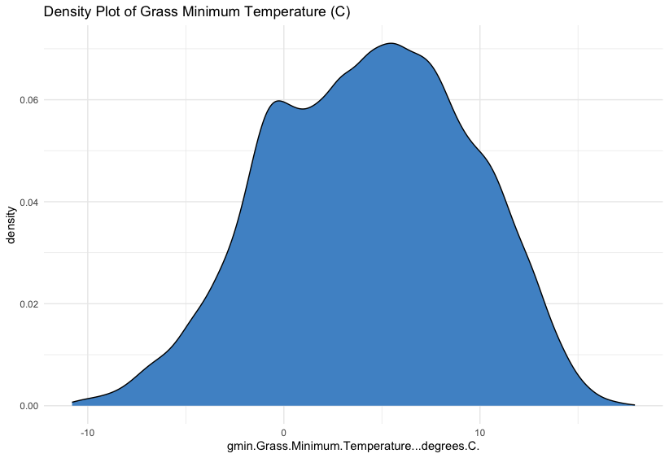
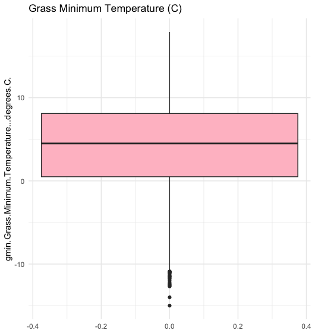
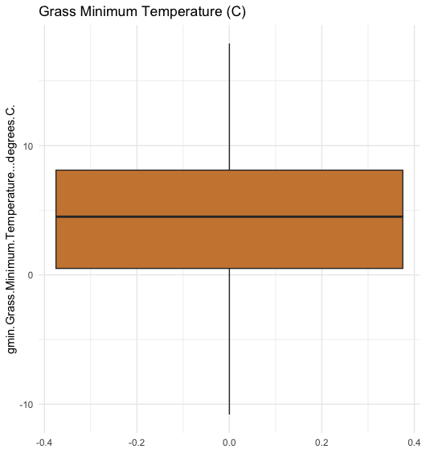
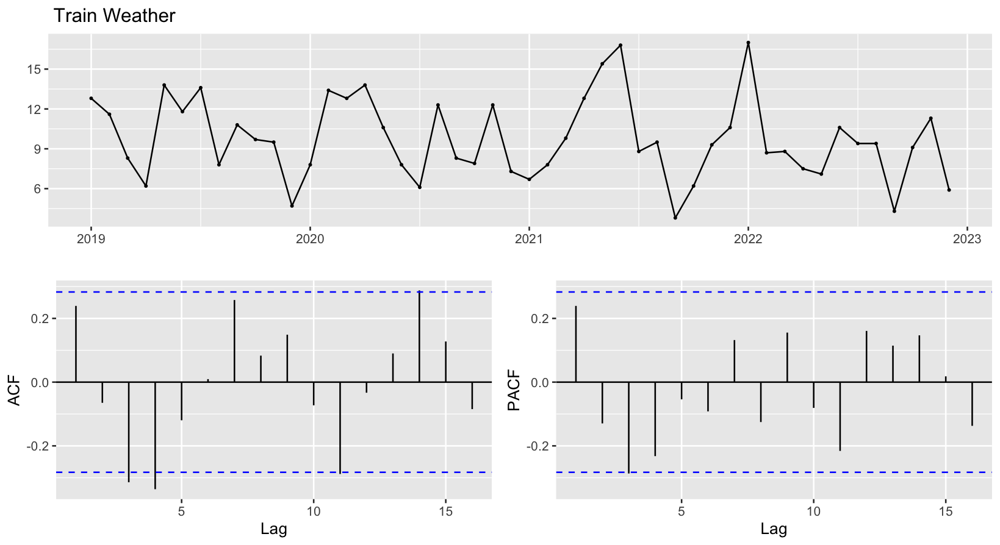
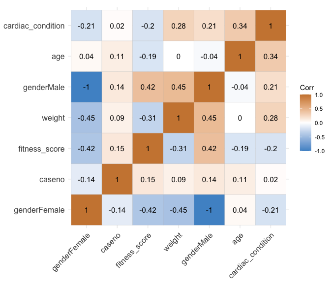

# Time Series and Logistic Regression
 Time Series Analysis on Weather Data and Logistic Regression Analysis on Cardiac Data

# Weather Forecasting and Cardiac Condition Prediction using Time Series & Logistic Regression

## Project Overview

This project consists of two main analyses:

1. **Time Series Analysis** of weather data, focusing on predicting grass minimum temperature using various forecasting models.
2. **Logistic Regression Analysis** to predict the presence/absence of cardiac conditions using binary classification.

### Main Objectives:
- **Time Series Analysis**: Compare various time series models and identify the most suitable for weather forecasting.
- **Logistic Regression**: Identify significant factors contributing to cardiac conditions and develop an accurate prediction model.

---

## Dataset Information

### 1. Weather Data (Time Series Analysis)
- **Instances**: 29,889
- **Variables**: 9, including `gmin` (Grass Minimum Temperature), `evap` (Evaporation), and `Date`.

#### Key Characteristics:
- **Missing Values**: Present in `gmin` and `evap`. Handled using removal techniques.
- **Outliers**: Detected using the Interquartile Range (IQR) and handled by median imputation.

### 2. Cardiac Data (Logistic Regression)
- **Instances**: 100
- **Attributes**: 6, including `Age`, `Weight`, and `Fitness Score`.

#### Key Characteristics:
- **Class Imbalance**: 65% of instances labeled as "Absent" for cardiac condition, 35% as "Present". Addressed using oversampling techniques.

---

## Project Workflow

### 1. Time Series Analysis
- **Exploratory Data Analysis (EDA)**: Data cleaning, normalization, and missing value handling.
- **Models Tested**:
  - **Simple Time Series**: Average, Naive, Seasonal Naive, and Drift methods.
  - **Exponential Smoothing**: Simple Exponential Smoothing (SES), Holt’s Method, ETS models.
  - **ARIMA/SARIMA**: Autoregressive Integrated Moving Average.

### 2. Logistic Regression Analysis
- **Class Imbalance Handling**: Oversampling was applied to balance the cardiac dataset.
- **Exploratory Data Analysis (EDA)**: Outlier detection using IQR and data normalization via Kernel Density Estimation (KDE).
- **Feature Selection**: Stepwise backward elimination used to refine the model.

---

## Graphical Representation

### 1. Weather Data Exploration
- **Density Plot** of `gmin` (Grass Minimum Temperature) showing the distribution skewed towards higher temperatures.



- **Outlier Detection** before and after handling using IQR.

 

### 2. Time Series Modeling
- **Raw Time Series Plot** for `gmin` from 1942-2023.


- **ARIMA ACF & PACF** plots for model diagnosis.



### 3. Logistic Regression Results
<!-- - **ROC Curve** showing model performance with an AUC of 0.9259.

 -->

- **Correlation Heatmap** for numerical variables in the cardiac dataset.



---

## Model Evaluation & Results

### 1. Time Series Analysis

| Model                   | RMSE     | MAE      | MAPE    |
|--------------------------|----------|----------|---------|
| **Mean Model**            | 3.05     | 2.46     | 29.62%  |
| **Naive Model**           | 3.73     | 3.01     | 36.00%  |
| **Seasonal Naive Model**  | 4.46     | 3.69     | 41.04%  |
| **Drift Model**           | 3.73     | 3.01     | 36.00%  |

**Best Model**: **Mean Model** for its lowest RMSE and MAE.

#### Exponential Smoothing Models

| Model                     | AIC      | RMSE     | MAE      |
|----------------------------|----------|----------|----------|
| **SES**                    | 298.97   | 3.05     | 2.46     |
| **Holt’s Method**          | 301.34   | 3.00     | 2.37     |
| **ETS(A,A,A)**             | 314.33   | 2.67     | 2.19     |

**Best Model**: **ETS(A,A,A)** for capturing seasonality.

#### ARIMA/SARIMA Results

| Model         | AIC      | RMSE     | MAE      |
|---------------|----------|----------|----------|
| **ARIMA(0,0,1)** | 246.19   | 2.95     | 2.38     |

**Best ARIMA Model**: **ARIMA(0,0,1)**, verified via ACF/PACF plots.

### 2. Logistic Regression Analysis

- **Model 1**: Initial logistic regression model with an accuracy of **83.3%**, AIC: 114.56.
- **Model 2**: Refined using stepwise selection, accuracy improved to **89%** with AIC: 113.11.

#### Confusion Matrix & Classification Report:

| Metric        | Value   |
|---------------|---------|
| **Precision** | 0.875   |
| **Recall**    | 0.889   |
| **F1 Score**  | 0.824   |
| **AUC (ROC)** | 0.9259  |

---

## Requirements

- **Programming Language**: Python 3.8+
- **Libraries**:
  - `pandas`
  - `numpy`
  - `statsmodels`
  - `scikit-learn`
  - `matplotlib`
  - `seaborn`

Install the required libraries via `pip`:

```bash
pip install pandas numpy statsmodels scikit-learn matplotlib seaborn
